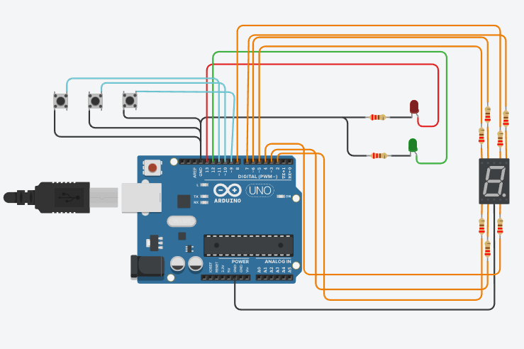

# Practico de 1°er parcial 

## Alumno:
 
 * Corimayo Alan

## Proyecto: Montacargas



### Descripción

Debiamos crear el programa de un montacargas que minimo pueda subir o bajar un piso cuando se pulse el boton,ademas de encender un led verde si esta en movimiento o uno rojo en caso de estar detenido.Y de manera opcional un boton de parar para detener el montacargas mientras este movimiento. 

### Función principal
Asignación de pines:
```c++
#define boton_subir 9
#define boton_bajar 11
#define boton_stop 10
#define led_rojo 13
#define led_verde 12
#define seg_A 8
#define seg_B 7
#define seg_C 4
#define seg_D 3
#define seg_E 2
#define seg_F 6
#define seg_G 5
```
Declaración y inicialización de variables:
```c++
int contador_de_pisos = 0;
int contador_boton_stop = 0;
int piso_anterior;
bool en_movimiento;
```
Entradas y salidas digitales:
```c++
void setup()
{
  pinMode(2, OUTPUT);
  pinMode(3, OUTPUT);
  pinMode(4, OUTPUT);
  pinMode(5, OUTPUT);
  pinMode(6, OUTPUT);
  pinMode(7, OUTPUT);
  pinMode(8, OUTPUT);
  pinMode(13, OUTPUT);
  pinMode(12, OUTPUT);
  //botones en pull up
  pinMode(9, INPUT_PULLUP);
  pinMode(10, INPUT_PULLUP);
  pinMode(11, INPUT_PULLUP);
  Serial.begin(9600);
  //Que empiece en 0 el display
  numero_pisos(contador_de_pisos);
}

```
Si se pulsa el boton subir o bajar entra a la función subir_bajar_pisos.

```c++
void loop()
{
  int estadoBsubir = digitalRead(9);
  int estadoBbajar = digitalRead(11);
  delay(100);
  if (estadoBsubir == 0 || estadoBbajar == 0)
  {
    subir_bajar_pisos(estadoBsubir,estadoBbajar);
  }
}
```
Dentro de la función se recibe por parametro los estados del boton subir o bajar para determinar que hacer.Si se sube el contador de pisos se le suma 1 de lo contrario se le resta 1,en caso de estar en en piso 0 no se hara nada si se presiona bajar.

```c++
en_movimiento = true;
piso_anterior = contador_de_pisos;
  if(subir == 0)
  {
  	contador_de_pisos++;
    digitalWrite(12, HIGH);
    Serial.print("El montacargas esta subiendo al piso:");
    Serial.print(contador_de_pisos);
    Serial.println();
  }
  else if(contador_de_pisos > 0 && bajar == 0)
  {
    contador_de_pisos-=1;
    digitalWrite(12, HIGH);
    Serial.print("El montacargas esta bajando al piso:");
    Serial.print(contador_de_pisos);
    Serial.println();
  }
```
Luego entra a un for en el cual se comprobara que durante los 3 segundos que tarda en subir/bajar un piso si se presiona el boton de parar.Si se presiona el contador_boton_stop(inicializado previamente en 0) aumenta en 1 y en_movimiento pasa a false.
Si el contador es impar apaga la luz verde de en movimiento y prende la roja, mostrando un mensaje indicando que el montacargas se encuentra parado.

Entra a un while que permanecera en true hasta que el boton sea pulsado de nuevo y reanude su funcionamiento.

```c++
for(int i=0;i<20;i++)
  {
    int estadoBstop = digitalRead(10);
    delay(100);
    if(estadoBstop == 0)
    {
      contador_boton_stop++;
      estadoBstop = 1;
      en_movimiento = false;
      
      if(contador_boton_stop %2 == 1)
      {
        digitalWrite(12,LOW);
        digitalWrite(13, HIGH);
        Serial.print("El montacargas esta detenido.Entre los pisos ");
        Serial.print(piso_anterior);
        Serial.print(" y ");
        Serial.print(contador_de_pisos);
        Serial.println();
        while(contador_boton_stop % 2 == 1 && en_movimiento == false)
        {
          if (estadoBstop == 0)
          {
           en_movimiento = true;
           contador_boton_stop++;
           digitalWrite(13,LOW);
           digitalWrite(12, HIGH);
          }
          estadoBstop = digitalRead(10);
          delay(100);
        }
      }
    }
   delay(50);
  }
```
Y por ultimo al llegar al piso apaga la luz de en movimiento y muestra mediante el display el piso actual.
```c++
numero_pisos(contador_de_pisos);
  digitalWrite(12, LOW);
```
función numero_pisos segun el numero del contador muestra el numero del piso correspondiente.Encendiendo los segmentos para formar el numero
```c++
void numero_pisos(int contador)
{
  digitalWrite(2 ,LOW);
  digitalWrite(3 ,LOW);
  digitalWrite(4 ,LOW);
  digitalWrite(5 ,LOW);
  digitalWrite(6 ,LOW);
  digitalWrite(7 ,LOW);
  digitalWrite(8 ,LOW);
  if(contador == 0)
  {
    digitalWrite(2 ,HIGH);
    digitalWrite(4 ,HIGH);
    digitalWrite(3 ,HIGH);
    digitalWrite(6 ,HIGH);
    digitalWrite(7 ,HIGH);
    digitalWrite(8 ,HIGH);
  }
  else if(contador == 1)
  {
    digitalWrite(7 ,HIGH);
    digitalWrite(4 ,HIGH);
  }
  else if(contador == 2)
  {
    digitalWrite(8 ,HIGH);
    digitalWrite(5 ,HIGH);
    digitalWrite(3 ,HIGH);
    digitalWrite(2 ,HIGH);
    digitalWrite(7 ,HIGH);
  }
  else if(contador == 3)
  {
    digitalWrite(3 ,HIGH);
    digitalWrite(4 ,HIGH);
    digitalWrite(5 ,HIGH);
    digitalWrite(7 ,HIGH);
    digitalWrite(8 ,HIGH);
  }
  else if(contador == 4)
  {
    digitalWrite(4 ,HIGH);
    digitalWrite(5 ,HIGH);
    digitalWrite(6 ,HIGH);
    digitalWrite(7 ,HIGH);
  }
  else if(contador == 5)
  {
    digitalWrite(3 ,HIGH);
    digitalWrite(4 ,HIGH);
    digitalWrite(5 ,HIGH);
    digitalWrite(6 ,HIGH);
    digitalWrite(8 ,HIGH);
  }
  else if(contador == 6)
  {
    digitalWrite(2 ,HIGH);
    digitalWrite(3 ,HIGH);
    digitalWrite(4 ,HIGH);
    digitalWrite(5 ,HIGH);
    digitalWrite(6 ,HIGH);
    digitalWrite(8 ,HIGH);
  }
  else if(contador == 7)
  {
    digitalWrite(4 ,HIGH);
    digitalWrite(6 ,HIGH);
    digitalWrite(7 ,HIGH);
    digitalWrite(8 ,HIGH);
  }
  else if(contador == 8)
  {
    digitalWrite(2 ,HIGH);
    digitalWrite(3 ,HIGH);
    digitalWrite(4 ,HIGH);
    digitalWrite(5 ,HIGH);
    digitalWrite(6 ,HIGH);
    digitalWrite(7 ,HIGH);
    digitalWrite(8 ,HIGH);
  }
  else if(contador == 9)
  {
    digitalWrite(3 ,HIGH);
    digitalWrite(4 ,HIGH);
    digitalWrite(5 ,HIGH);
    digitalWrite(6 ,HIGH);
    digitalWrite(7 ,HIGH);
    digitalWrite(8 ,HIGH);
  }
}
``` 
## Link al proyecto 

[tinkercard.com](https://www.tinkercad.com/things/2QiwiOmNqmp "Link al arduino")

### Fuentes 

[Consigna](https://docs.google.com/document/d/1lJ_nhPuvKi0eT4uPIGk1BPKNiBokrveLiJ3JNe26Urc/edit (Consignas))

[Tutorial de git](https://www.youtube.com/watch?v=oxaH9CFpeEE)

[Ejemplo de git](https://github.com/Estebamq/EjemploDocumentacion)

